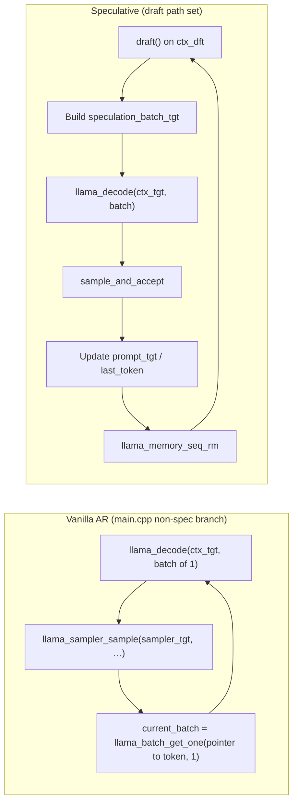
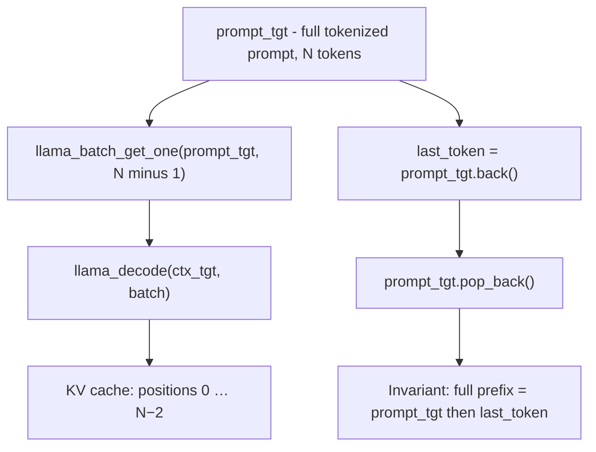
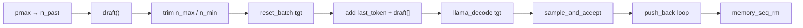
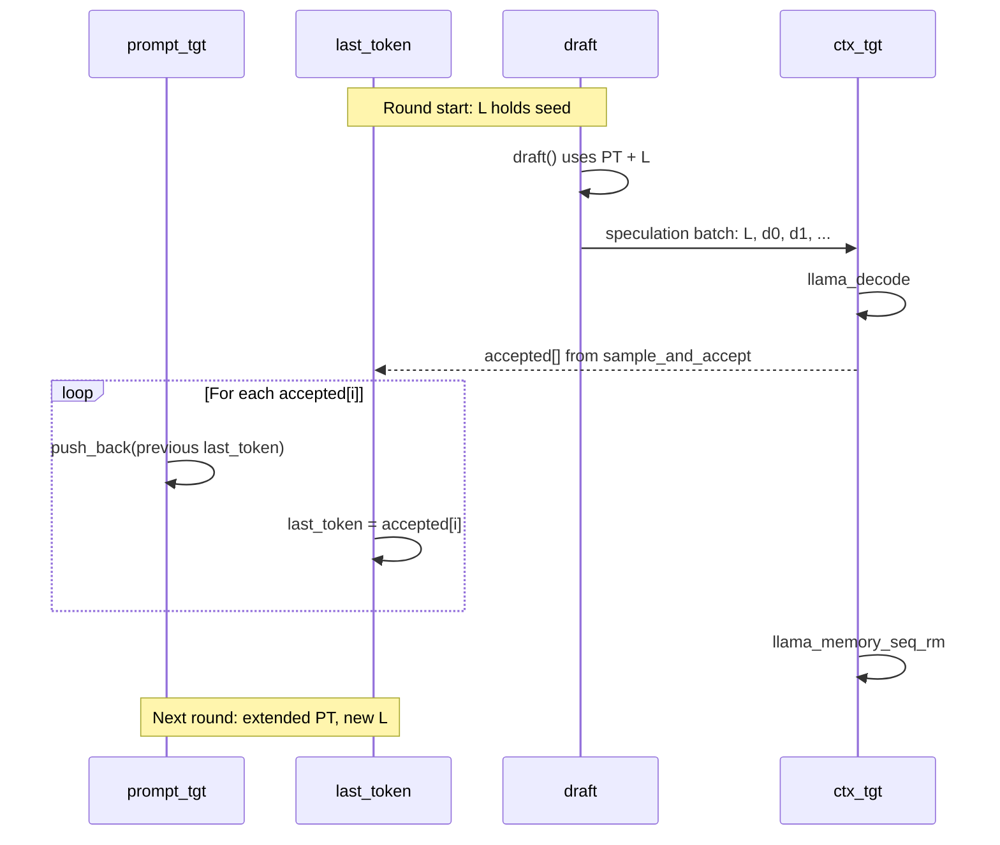
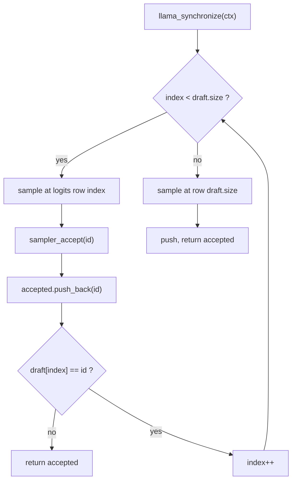
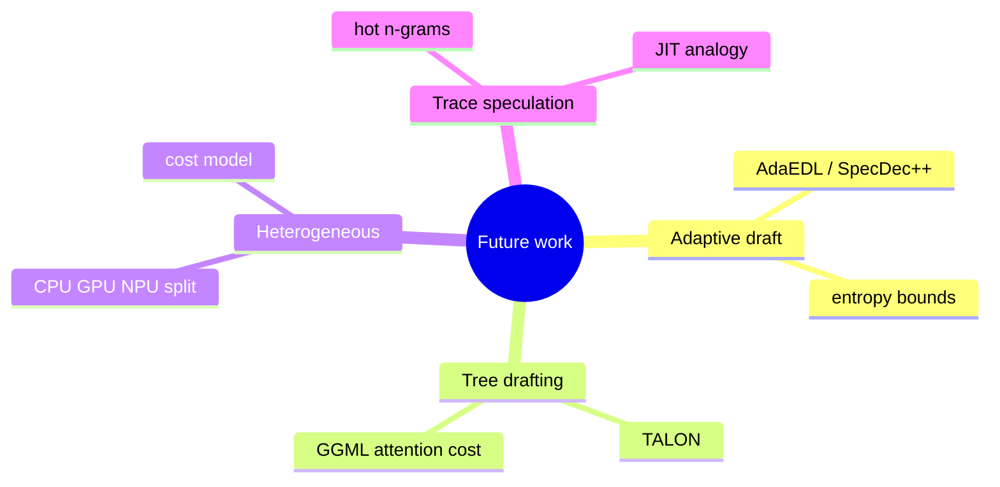

# Mermaid sources (Spectre / speculative decoding)

Copy any block into [Mermaid Live Editor](https://mermaid.live) or into Markdown (GitHub, GitLab, Obsidian).

Diagrams mirror `spectre/src/main.cpp` and `html/atlas.html`.

---

## AR vs speculative

## Target prefix init

## One round pipeline

## Sample propagation (sequence)

## sample_and_accept

## Future work (mind map)

